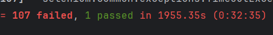

# Тестовое задание на должность Стажер автоматизатор тестирования/AQA Intern

## Первым делом запустите виртуальное окружение
Для Windows:
```sh
.\Scripts\activate
```
Для macOS и Linux:
```sh
source bin/activate
```


## Далее запустите автотест написав в корневом пути 
```sh
pytest
```
Результат будет выглядеть так:


При заполнении формы есть 108 различных вариантов из них только один будет правильным, что собственно я и показал.
Для input-ов username, mail и password есть 3 различных варианта заполнения: правильный, неправильный и пустой
Для input-a реферального кода есть 2 варианта заполнения: правильный и неправильный, пустой будет считаться правильным
ну и 2 варианта когда соглашаешься и не соглашаешься с Пользовательским соглашением 
так можно посчитать что 3x3x3x2x2 будет 108

Эти 108 вариантов были сгенерированы и описаны в файле generator.py
так же использую parametrize удалось проверить все 108 вариантов